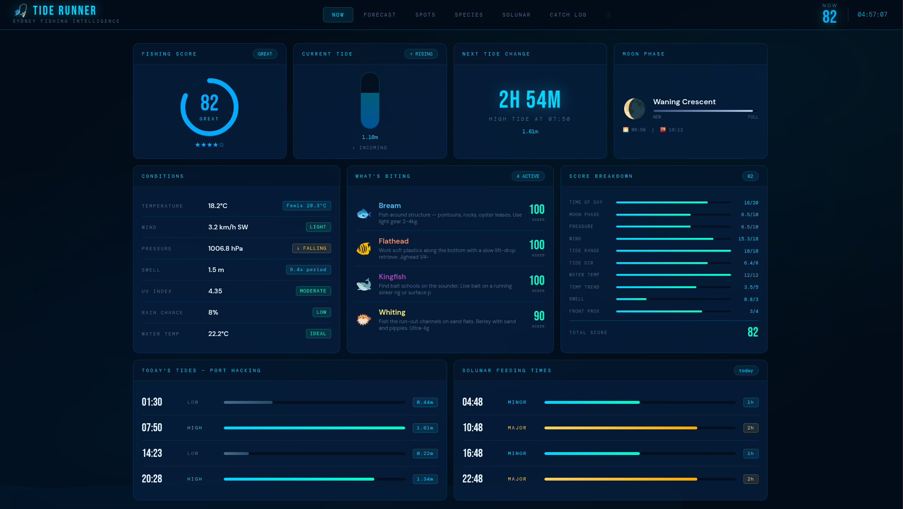
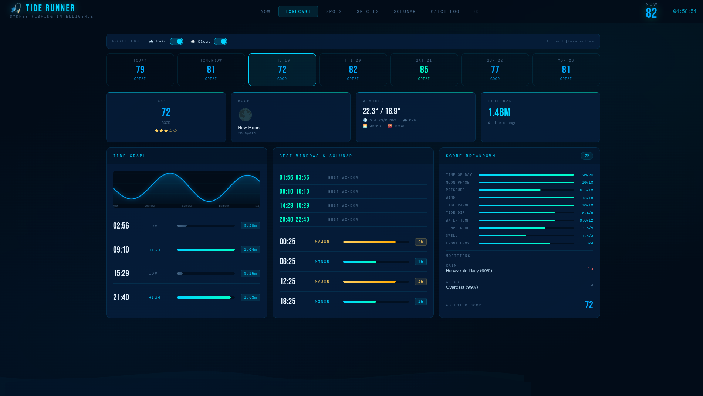
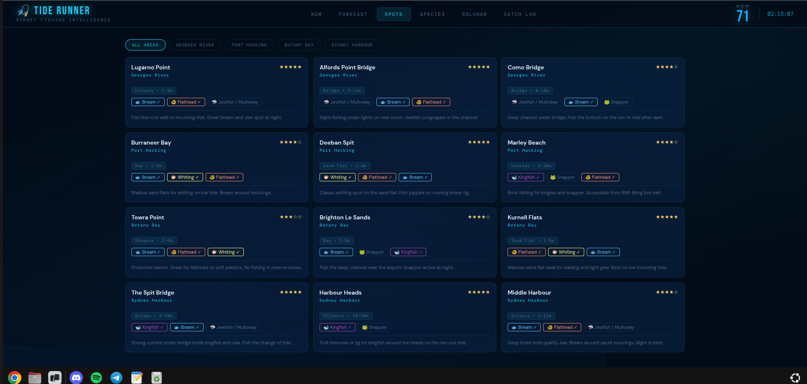
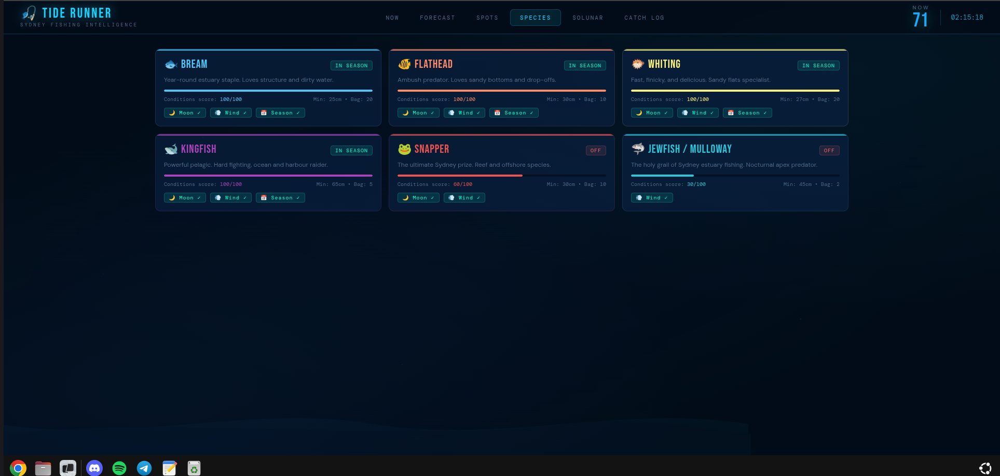
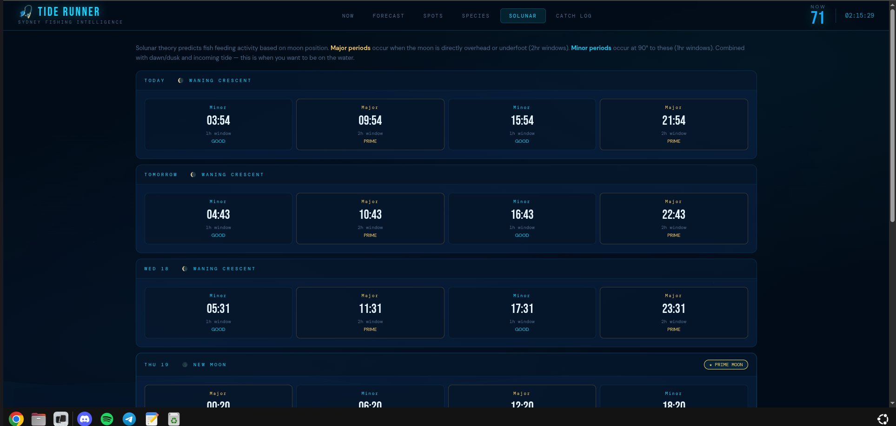
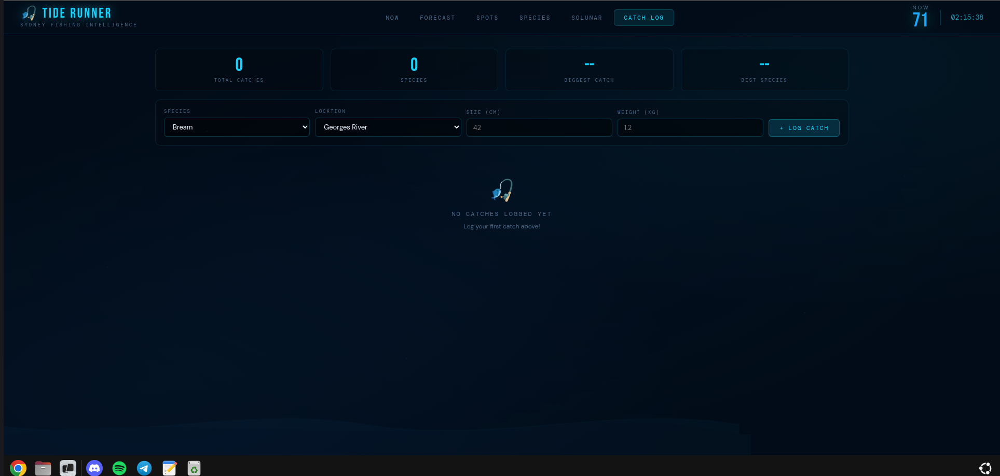

# 🎣 Tide Runner

> **The best personal fishing intelligence tool for Australian anglers.**  
> Live tides, moon phase, solunar tables, species guides, weather conditions, and catch logging — all self-hosted, all free.



---

## ✨ Features

### 🏠 Live Conditions Dashboard
Real-time fishing score (0–100) calculated from 10 weighted factors: tidal range, tidal direction, moon phase, barometric pressure trend, wind speed, sea surface temperature, temperature trend, swell height, front proximity, and time of day. Animated score ring with live factor breakdown, live tide height interpolation, next tide countdown, and species activity analysis.

### 📅 7-Day Forecast
Interactive day-by-day fishing forecast with clickable tabs, real tide graphs with current-time marker, solunar overlay, weather breakdown, and best fishing windows per day.

### 🗺️ Fishing Spots
12 curated spots across Georges River, Port Hacking, Botany Bay, and Sydney Harbour — filterable by area, with in-season species tags, depth info, and pro tips. Click any spot for full detail.

### 🐟 Species Guide
6 target species (Bream, Flathead, Whiting, Kingfish, Snapper, Jewfish/Mulloway) with real-time condition scoring, seasonal indicators, legal sizes, bag limits, bait recommendations, and NSW DPI-sourced regulations.

### 🌙 Solunar Tables
7-day lunar feeding tables using John Alden Knight's solunar theory. Major periods (2hr, moon overhead/underfoot) and minor periods (1hr, 90° offset) calculated astronomically — zero API calls.

### 📓 Catch Log
Personal catch database with species, location, size, and weight. Persistent JSON storage. Stats dashboard showing total catches, species count, and personal bests.

### 📊 Score Breakdown
Live per-factor breakdown card showing each of the 10 scoring variables and their individual contributions to the total score — no black boxes.

### ℹ️ Methodology
Full transparency page explaining exactly how every score, calculation, and recommendation is derived — including the 10-factor weighted formula, What's Biting species scoring, data sources, and solunar theory.

---

## 📸 Screenshots

| NOW | Forecast |
|-----|----------|
|  |  |

| Spots | Species |
|-------|---------|
|  |  |

| Solunar | Catch Log |
|---------|-----------|
|  |  |

---

## 📊 Scoring Algorithm

Tide Runner's fishing score is built on peer-reviewed
fisheries science — not solunar folklore.

> 📄 **[Full Algorithm Documentation & Scientific Basis →](ALGORITHM.md)**

10 environmental factors, weighted by evidence strength.
Every weight is justified by published research including
Stoner (2004), Quigley et al. (2023), Lowry et al. (2007 NSW),
Myers et al. (2016), and Agmour et al. (2020).

Unlike most fishing apps which over-index on solunar theory
(shown by peer-reviewed research to have weak predictive value
for estuarine species), Tide Runner prioritises water
temperature, tidal flow direction, and time of day — the
factors with ★★★★★ evidence ratings.

---

## 🛠️ Tech Stack

| Layer | Technology |
|-------|-----------|
| **Frontend** | Vanilla HTML/CSS/JavaScript — no framework, no build step |
| **Backend** | Python 3.12 — standard library HTTP server |
| **Tide Data** | [WorldTides API](https://www.worldtides.info) — fetched twice weekly, cached locally |
| **Weather/Swell** | [Open-Meteo](https://open-meteo.com) — free, no API key required |
| **Sea Surface Temp** | [Open-Meteo Marine API](https://open-meteo.com) — free, no API key required |
| **Moon Phase** | Local astronomical algorithm (synodic cycle calculation) |
| **Solunar Times** | Local calculation (John Alden Knight method) |
| **Catch Storage** | Local JSON file — your data never leaves your machine |
| **Service** | systemd user service — auto-starts on boot |

---

## 🚀 Quick Start

### Prerequisites
- Python 3.10+
- A free [WorldTides API key](https://www.worldtides.info/register) (100 free credits on signup — enough for ~50 days at 2 credits/week)

### Installation

```bash
# Clone the repo
git clone https://github.com/Stell619/tide-runner.git
cd tide-runner

# Copy and configure environment
cp .env.example .env
nano .env  # Add your WorldTides API key and coordinates
```

### Configure your location

Edit `.env`:
```env
WORLDTIDES_API_KEY=your-key-here
LATITUDE=-33.9558
LONGITUDE=151.0617
LOCATION_NAME=Port Hacking, NSW
TIMEZONE=Australia/Sydney
```

### Fetch initial tide data

```bash
python fetch_tides.py
```

This uses **1 credit** (out of your 100 free) and caches 7 days of tide data locally.

### Start the server

```bash
python server.py
```

Open `http://localhost:3004` in your browser.

### Run as a service (auto-start on boot)

```bash
# Copy service file
cp tide-runner.service ~/.config/systemd/user/
systemctl --user daemon-reload
systemctl --user enable tide-runner
systemctl --user start tide-runner
```

### Set up automatic tide fetching (twice weekly)

```bash
crontab -e
# Add:
0 0 * * 1,4 python3 /path/to/fetch_tides.py >> /tmp/tides.log 2>&1
```

---

## 📡 Data Sources & Cost

| Source | Data | Cost |
|--------|------|------|
| WorldTides API | Tide predictions | **~2 credits/week** (~$0.02/year after free tier) |
| Open-Meteo | Weather, swell, UV | **Free forever** — no key needed |
| Local calculation | Moon phase, solunar | **Free** — zero API calls |
| Local JSON | Catch log | **Free** — stored on your machine |

**Total ongoing cost: essentially zero.**

---

## 🗺️ Supported Locations

Tide Runner is pre-configured for **Sydney, Australia** with spots across:

- 🌊 **Georges River** — Lugarno Point, Alfords Point Bridge, Como Bridge
- 🦞 **Port Hacking** — Burraneer Bay, Deeban Spit, Marley Beach
- 🐟 **Botany Bay** — Towra Point, Brighton Le Sands, Kurnell Flats
- 🎣 **Sydney Harbour** — The Spit Bridge, Harbour Heads, Middle Harbour

**Want to add your own location?** Edit `SPOTS` in `server.py` — it's just a Python list of dictionaries. Pull requests welcome!

---

## 🐟 Target Species

| Species | Min Size | Bag Limit | Best Season |
|---------|----------|-----------|-------------|
| Bream | 25cm | 20 | Year-round |
| Flathead | 30cm | 10 | Oct–Mar |
| Whiting | 27cm | 20 | Nov–Apr |
| Kingfish | 65cm | 5 | Oct–Apr |
| Snapper | 30cm | 10 | Aug–Jan |
| Jewfish/Mulloway | 45cm | 2 | Apr–Oct |

*Legal sizes and bag limits sourced from NSW DPI. Always verify current regulations at [dpi.nsw.gov.au](https://www.dpi.nsw.gov.au).*

---

## 🧮 Fishing Score Algorithm

The overall score (0–100) is a weighted composite of 10 factors, rebalanced based on peer-reviewed fisheries research:

```
Score = (time×0.20) + (moon×0.10) + (pressure×0.10) +
        (wind×0.18) + (tide_range×0.10) +
        (tide_direction×0.08) + (temp_abs×0.12) +
        (temp_trend×0.05) + (swell×0.03) + (front×0.04)
```

Plus rain and cloud modifiers applied after the weighted sum.

| Factor | Weight | Key finding |
|--------|--------|-------------|
| Time of day | 20% | Dawn/dusk — ★★★★★ strongest predictor |
| Moon phase | 10% | Reduced — weak for estuarine species (Quigley 2023) |
| Pressure trend | 10% | Reduced — direct effect unproven (Ross/WHOI) |
| Wind speed | 18% | Increased — stronger predictor than pressure |
| Tidal range | 10% | Sweet spot 0.8–1.8m |
| Tidal direction | 8% | NEW — incoming vs outgoing |
| Sea surface temp | 12% | Increased — primary driver (Stoner 2004) |
| Temp trend | 5% | NEW — direction of change matters |
| Swell height | 3% | Reduced — minor for estuaries |
| Front proximity | 4% | NEW — pre-frontal feeding spike |

Scores: **PRIME** ≥90 · **GREAT** ≥78 · **GOOD** ≥62 · **AVERAGE** ≥45 · **POOR** <45

> 📄 See [ALGORITHM.md](ALGORITHM.md) for full scientific basis with 15+ peer-reviewed citations.

---

## 📁 Project Structure

```
tide-runner/
├── server.py          # Python HTTP server + all API endpoints
├── index.html         # Full frontend (single file — no build step)
├── fetch_tides.py     # WorldTides API fetcher (run twice weekly)
├── ALGORITHM.md       # Scoring algorithm scientific methodology
├── tide-runner.service # systemd service file
├── .env.example       # Environment variable template
├── cache/             # Tide data cache (auto-created)
├── screenshots/       # README screenshots
└── README.md
```

---

## 🔧 Extending Tide Runner

### Adding a new fishing spot

In `server.py`, add to the `SPOTS` list:

```python
{
    "id": "my_spot",
    "name": "My Favourite Rock",
    "area": "Port Hacking",
    "lat": -34.0760, "lon": 151.1080,
    "depth": "2-8m",
    "species": ["bream", "flathead"],
    "type": "Rock Platform",
    "tips": "Fish the ledge on incoming tide.",
    "rating": 4
}
```

### Adding a new species

Add to the `SPECIES` dictionary in `server.py` following the existing pattern. Includes condition scoring, season data, bait recommendations, and legal sizes.

### Changing your location

Update `.env` with your coordinates. Tide Runner works for any coastal location worldwide — WorldTides covers global tidal data.

---

## 🌏 Expanding Beyond Sydney

Want to adapt this for Melbourne, Brisbane, Perth, or anywhere else? The only location-specific parts are:

1. **Spots list** — add your local spots
2. **Species list** — adjust for your local species
3. **Coordinates** — update `.env`
4. **WorldTides station** — the API automatically finds the nearest station

Pull requests for other Australian cities are very welcome!

---

## 🗺️ Roadmap

### 🚧 In Progress
- ⚙️ Continue updating page layouts
- 📱 Mobile responsive layout

### 📋 Planned
- 🗺️ Expand locations beyond Sydney
- 📍 User-configurable fishing spots
- 🔔 Tide alerts via push notification
- 📈 Historical catch data charts
- 🏆 Species size/weight tracker with PB records
- 🌧️ Weather radar integration
- 📶 Offline mode — full PWA support
- 🪟 Windows support

### 💭 Considering
- 🌐 Hosting a public version
- 📲 iOS/Android app wrapper
- 👥 Community spot submissions

---

## 🤝 Contributing

Contributions welcome! Especially:

- 🗺️ Fishing spots for other Australian cities
- 🐟 Additional species (Tailor, Luderick, Tuna, Mulloway etc)
- 🐛 Bug fixes and improvements
- 📱 Mobile UX improvements

Please open an issue first for major changes.

---

## 📄 License

MIT License — see [LICENSE](LICENSE) for details.

---

## ⚠️ Disclaimer

Tide Runner provides fishing intelligence based on environmental data and established fishing theory. Scores and recommendations are guidance only. Always check current NSW DPI regulations before fishing. Never rely solely on this tool for navigational or safety decisions on the water.

---

*Built in Sydney, Australia 🦘 | Self-hosted, open source, free forever | v2.1*
